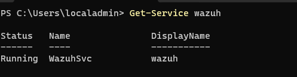
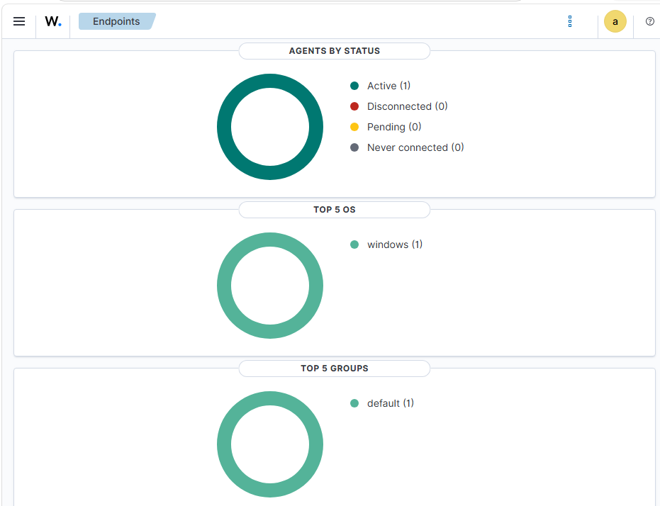

# Day 3: Windows Endpoint Enrollment

## Objective

Deploy a Windows virtual endpoint on a separate physical computer and connect it to the Wazuh manager for centralized security monitoring.

## Architecture

- Computer 1: Wazuh virtual appliance
- Computer 2: Windows endpoint virtual machine
- Wazuh network mode: Bridged
- Windows network mode: NAT
- Network: Private home network
- Endpoint hostname: WIN-ENDPOINT-01

## Windows VM Resources

- Memory: 4 GB
- Processor allocation: 2 cores
- Storage: 50–60 GB
- Operating system:
- Wazuh agent version:

## Implementation

1. Deployed and updated a Windows virtual endpoint.
2. Verified connectivity to Wazuh on TCP ports 1514 and 1515.
3. Installed the official Wazuh agent using the dashboard-generated command.
4. Started and validated the Windows agent service.
5. Confirmed that the endpoint appeared as active in Wazuh.

## Validation

- Wazuh dashboard accessible from Computer 2: Yes
- TCP port 1514 reachable: Yes
- TCP port 1515 reachable: Yes
- Wazuh agent service running: Yes
- WIN-ENDPOINT-01 status: Active

## Evidence

## Security Considerations

- Kept the Wazuh dashboard restricted to the private home network.
- Did not configure internet-facing router port forwarding.
- Used a dedicated lab endpoint and lab-only credentials.
- Kept Kali powered off during endpoint enrollment.

## Challenges and Solutions

Tried to run two VM on one computer but my computer didn't have the capabilities to do so.
So instead I used two computers by having the wazuh vm be bridged network connection.
Through that I was able to access wazuh dashboard on computer 2 that was running windows vm.

## Next Step

Install Sysmon and validate enhanced Windows event collection in Wazuh.