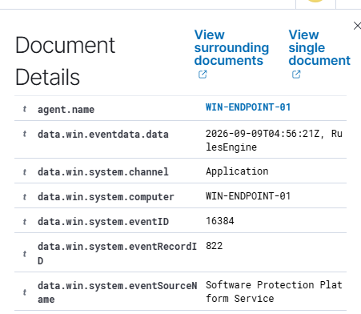

# Day 4: Sysmon Integration

## Objective

Enhance Windows endpoint visibility by installing Sysmon and forwarding its event channel to Wazuh.

## Environment

- Endpoint: WIN-ENDPOINT-01
- Sysmon version:
- Sysmon configuration: Sysmon Modular
- Wazuh agent status: Active
- Network: Private home network

## Implementation

1. Installed Microsoft Sysmon with a community-maintained filtering configuration.
2. Verified that the Sysmon service and operational event channel were active.
3. Configured the Wazuh agent to collect the Sysmon operational event channel.
4. Restarted the Wazuh agent and generated controlled test activity.
5. Located the resulting Windows process telemetry in Wazuh.

## Validation

- Sysmon service running: Yes
- Wazuh agent service running: Yes
- Local Sysmon events generated: Yes
- Sysmon event received by Wazuh: Yes
- Process and command-line details visible: Yes

## Evidence

## Security Value

Sysmon provides more detailed endpoint telemetry than standard Windows logs,
including process relationships and command-line execution data that can assist
with threat hunting and incident investigation.

## Challenges and Solutions
#Sysmon executable was missing

After downloading the Sysmon configuration file, I could not locate Sysmon64.exe in PowerShell.
I determined that the configuration file and the Sysmon application were separate downloads. 
I downloaded the official Sysmon ZIP from Microsoft Sysinternals, extracted it into 
C:\Tools\Sysmon, and verified the required files with PowerShell before installing the service.

#Expected attacks after installing Sysmon

After installing Sysmon, I initially expected the Wazuh dashboard to display attacks 
automatically. I learned that Sysmon records endpoint activity but does not classify 
every action as malicious. I generated harmless commands, verified the resulting events 
locally in the Sysmon Operational log, and searched Wazuh using the Sysmon channel and Event 
ID 1.

#Identifying useful evidence

The dashboard contained routine Windows events, including Software Protection Platform 
activity, which did not clearly demonstrate the Sysmon integration. 
I filtered for Microsoft-Windows-Sysmon/Operational events and selected a 
process-creation event showing the endpoint, executed command, parent process, 
and timestamp as stronger evidence that telemetry reached Wazuh.
Had challenges trying to 

## Next Step

Generate controlled security events and investigate the resulting Wazuh alerts.