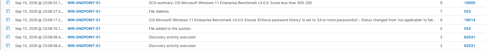

# Day 5: Controlled Detection Testing

## Objective

Generate controlled Windows security events and investigate the resulting
Wazuh alerts.

## Detection 1: Local Account Creation

- Endpoint: WIN-ENDPOINT-01
- Temporary account: soc-test
- Windows Event ID: 4720
- MITRE ATT&CK: T1136.001 — Create Account: Local Account
- Result: Detected

### Analysis

The alert showed that a new local account was created. Unexpected account
creation can indicate an attempt to establish persistent access. An analyst
should verify the initiating user, account privileges, approval records, and
surrounding authentication activity.

## Detection 2: File Integrity Monitoring

- Endpoint: WIN-ENDPOINT-01
- Monitored directory: C:\SOC-Lab
- Test file: test-document.txt
- Result: Detected

### Analysis

Wazuh detected changes to a file inside the monitored directory. Unexpected
file changes can indicate tampering, persistence, or unauthorized
configuration changes. An analyst should identify the responsible user and
process and determine whether the change was authorized.

## Cleanup

- Removed the temporary soc-test account.
- Deleted the test file.
- Retained C:\SOC-Lab for future authorized tests.

## Challenges and Solutions

I initially had trouble receiving Windows account-creation events on the Wazuh server. 
The activity generated Event ID 4720 locally, but it did not appear in the Wazuh dashboard. 
I verified the event in the Windows Security log, confirmed that the endpoint remained connected,
and checked the Wazuh agent configuration. After configuring the agent to collect the 
indows Security event channel and restarting the WazuhSvc service, 
I generated a fresh test event. Wazuh successfully detected it under rule 60109 with a severity level of 8.

## Conclusion

The controlled tests confirmed that Wazuh could detect account-management and
file-system activity from the Windows endpoint.